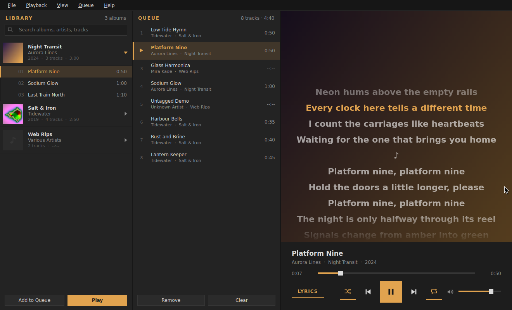

# Amber

A music player for local files, written in C++ with Qt 6 and TagLib. It is dark
grey with a yellowish-orange (`#e1a34f`) accent, and every corner is square.



## Features

- **Formats:** MP3, FLAC and WebM.
- **Album library:** Amber scans a music folder recursively and groups the
  tracks into albums, with cover thumbnails. Each album expands to show its
  tracks, and a search box filters by album, artist or track.
- **Queue:** you can add whole albums or single tracks:
  - double-click, or press <kbd>Enter</kbd>, to append;
  - <kbd>Ctrl</kbd>+<kbd>Enter</kbd> plays the selection now;
  - drag albums or tracks onto the queue, at any position;
  - right-click for *Play Now*, *Play Next*, *Add to Queue* or *Replace Queue*;
  - drop files or folders from a file manager onto the queue.

  Drag rows to reorder the queue, and press <kbd>Delete</kbd> to remove them.
- **Shuffle** and **repeat** (off → whole queue → current track). Shuffle
  plays every queued track once. Tracks you add while shuffling are mixed in
  among the tracks still to come; *Play Next* is always honoured; and
  *Previous* retraces the shuffled history.
- **Artwork:** Amber uses embedded cover art (ID3 `APIC`, FLAC pictures, and
  Matroska attachments with TagLib ≥ 2.2). Failing that, it looks for
  `cover.jpg`, `folder.png` and the like next to the file.
- **Lyrics, drawn over the blurred cover:**
  - a matching `.lrc` file next to the track (`Song.flac` → `Song.lrc`);
  - embedded synchronised lyrics (ID3 `SYLT`);
  - embedded plain lyrics (ID3 `USLT`, or `LYRICS`/`UNSYNCEDLYRICS` Vorbis
    comments; LRC text stored in these tags is also recognised as synced).

  Synced lyrics follow playback and highlight the current line, and you can
  click a line to jump to it. Scroll to look ahead; the view catches up again
  a few seconds later. Press <kbd>L</kbd> or the **LYRICS** toggle to switch
  back to the plain cover.
- **Session restore:** the queue, the current track and position, volume,
  shuffle, repeat and the window layout survive a restart.

## Building on Arch Linux

```sh
sudo pacman -S --needed base-devel cmake qt6-base qt6-multimedia qt6-multimedia-ffmpeg taglib
cmake -B build -DCMAKE_BUILD_TYPE=Release
cmake --build build
./build/amber-player
```

To install it system-wide, with a desktop entry and an icon:

```sh
sudo cmake --install build          # installs into /usr/local
```

Or build a package with the included `PKGBUILD`:

```sh
cd packaging/arch && makepkg -si
```

Qt Multimedia needs a playback backend. The FFmpeg one
(`qt6-multimedia-ffmpeg`) is recommended; the GStreamer backend works too.

Requirements: Qt ≥ 6.4 (Widgets, Multimedia, Concurrent), TagLib ≥ 1.12
(TagLib 2.x recommended) and a C++17 compiler.

## Usage

```sh
amber-player                       # opens the library from last time
amber-player ~/Music/Album  x.mp3  # queue files/folders and start playing
```

On first start Amber offers `~/Music` if it exists; otherwise choose a folder
with **File → Open Music Folder…** (<kbd>Ctrl</kbd>+<kbd>O</kbd>). Press
<kbd>F5</kbd> to rescan it. Unchanged files are read from a cache, so rescans
are quick.

| Key | Action |
| --- | --- |
| <kbd>Space</kbd> | Play / pause |
| <kbd>Ctrl</kbd>+<kbd>←</kbd> / <kbd>→</kbd> | Previous / next track |
| <kbd>Shift</kbd>+<kbd>←</kbd> / <kbd>→</kbd> | Seek 10 s |
| <kbd>Ctrl</kbd>+<kbd>↑</kbd> / <kbd>↓</kbd> | Volume up / down |
| <kbd>M</kbd> | Mute |
| <kbd>Ctrl</kbd>+<kbd>S</kbd> | Toggle shuffle |
| <kbd>Ctrl</kbd>+<kbd>R</kbd> | Cycle repeat mode |
| <kbd>L</kbd> | Show / hide lyrics |
| <kbd>Ctrl</kbd>+<kbd>F</kbd> | Search the library (<kbd>Esc</kbd> clears) |
| <kbd>Enter</kbd> / <kbd>Ctrl</kbd>+<kbd>Enter</kbd> | Queue / play the library selection |
| <kbd>Delete</kbd> | Remove the selected queue entries |

Settings are stored in `~/.config/amber-player/amber-player.conf`. The tag and
thumbnail caches live in `~/.cache/amber-player/`, and deleting that folder is
always safe.

## Notes on WebM

TagLib reads WebM (Matroska) tags from version 2.2 on. With an older TagLib,
Amber falls back to the file and folder names, then fills in the title, artist,
album, duration and artwork from the stream itself once the track starts
playing.

## Tests

```sh
cmake -B build -DAMBER_BUILD_TESTS=ON && cmake --build build && ctest --test-dir build
```

The tests cover the LRC/plain lyrics parser and the queue logic, including
shuffle, repeat, reordering and removal of the playing track.

## Source layout

| File | Purpose |
| --- | --- |
| `src/MainWindow.*` | Three-pane window, menus, shortcuts, session state |
| `src/Library.*` | Background folder scan, album grouping, tag and thumbnail caches |
| `src/LibraryView.*` | Album/track tree, search filter, drag source, context menu |
| `src/PlayQueue.*` | Queue model with shuffle order and repeat modes |
| `src/QueueView.*` | Queue list, reordering and drop target |
| `src/PlayerController.*` | `QMediaPlayer` driver: loading, advancing, error skipping |
| `src/NowPlayingPanel.*` | Artwork, track info, seek bar and transport controls |
| `src/CoverLyricsView.*` | Cover display and lyrics over the blurred cover |
| `src/MetadataReader.*` | TagLib access: tags, artwork, lyrics |
| `src/Lyrics.*` | LRC and plain-text lyrics parser |
| `src/Theme.*`, `src/Icons.*` | Palette, style sheet and painted icons |
